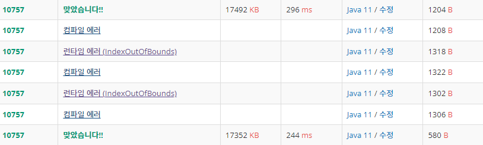

# [참고]
- BigitegerMain : BigInteger 이용
- HandMain : 직접 배열 만들어서 값 넣은 걸 이용

- [위] HandMain 결과
- [아래] BigintegerMain 결과 

****

# [새로 알게 된 점]
## BigInteger
- **int, long, Integer, Long과 달리 문자열 형태로 숫자를 처리하므로 아무리 큰 수라도 담을 수 있다.**
- BigInteger는 표현하고자 하는 자리수에 비례하여 사용하는 메모리 크기가 늘어난다.
- 비교
  - int
    - 범위 : -2,147,483,648 ~ 2,147,483,647
    - 메모리 크기 : 4 Byte
    - 기본형
    - 저장된 위치 : Stack
  - long
    - 범위 : -9,223,372,036,854,775,808 ~ 9,223,372,036,854,775,807
    - 메모리 크기 : 8byte
    - 기본형
    - 저장된 위치 : Stack
  - BigInteger
    - 범위 : 무한
    - 메모리 크기 : Minimum 70Byte
    - 참조형
    - 저장된 위치 : Heap
- 사용법
  - ***BigInteger big = new BigInteger("1001");***
  - **문자열**을 인자 값으로 넘겨 주어야 한다.
  - 사칙연산
    - 더하기(+) : .add();
    - 빼기(-) : .subtract();
    - 곱셈(*) : .multiply();
    - 나눗셈(/) : .divide();
    - 나머지(%) : .remainder();
  - 기본 타입으로 형변환 할 때
    - int로 형 변환
      - int b = big.intValue();
    - long으로 형 변환
        - long b = big.longValue();
    - float로 형 변환
        - float b = big.floatValue();
    - double로 형 변환
        - double b = big.doubleValue();
    - String으로 형 변환
        - String b = big.toString();
  - 두 개의 수 비교 : .compareTo()
    - 왼쪽이 작으면 : -1
    - 같으면 : 0
    - 왼쪽이 크면 : 1

## BigDecimal
- 소수점을 저장할 수 있는 타입인 float과 double은 소수점의 정밀도가 완벽하지 않아 값의 오차가 생길 수 있다.
- 그 이유는 내부적으로 이진수의 근사치를 저장하기 때문
- 따라서, **미세한 숫자의 변동도 허용하지 않는 특히 돈과 소수점을 다룬다면** BigDecimal을 사용해야한다.
- 이하 사용법은 BigInteger과 같다.