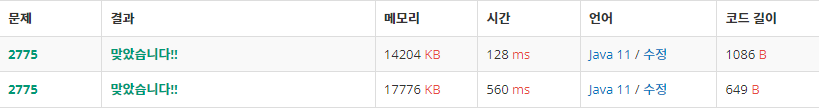

# [참고]
- RecursiveMain : 재귀 이용
- ArrayMain : 2차원 배열을 이용

- [위] 2차원 배열 이용
- [아래] 재귀 이용

****

# [문제 유형]
## 동적 계획법
- 하나의 큰 문제를 여러 개의 작은 문제로 나누어서 그 결과를 저장하여 다시 큰 문제를 해결할 때 사용
- 문제해결 패러다임
- 큰 문제를 작은 문제로 쪼개서 그 답을 저장해두고 재활용 

### DP를 쓰는 이유
- 일반적인 재귀 방식과 유사하지만, 일반적인 재귀 사용시 동일한 작은 문제들이 여러 번 반복되어 비효율적인 계산이 될 수 있다.
- 예
  - 피보나치 수열을 재귀로 함수를 구성하면 ; return f(n) = f(n-1) + f(n-1)
  - 가 되는데 호출되는 함수의 수가 기하급수적으로 증가
  - 하지만, 한번 구한 작은 문제의 결과 값을 저장해두고 재사용하게 된다면
  - **O(N^2) -> O(f(n))** 으로 개선

### DP의 사용조건
1. DFS, BFS로 풀기에 경우의 수가 많을 때
2. Overlapping Subproblems(겹치는 부분 문제) 
3. Optimal Substructure(최적 부분 구조)

***1. Overlapping Subproblems***
- 동일한 작은 문제들이 반복하여 나타나는 경우에 사용 가능

***2. Optimal Substructure(최적 부분 구조)***
- 부분 문제의 최적 결과 값을 사용해 전체 문제의 최적 결과를 낼 수 있는 경우
- 예
  - A-B까지의 가장 짧은 경로를 찾고자 하는 경우, 중간에 X가 있을 때 
  - A-X / X-B 가 많은 경로 중 가장 짧은 경로라면 전체 최적 경로도 A-X-B가 정답
  - 부분 문제에서 최적 결과가 전체 문제에서도 동일하게 적용되어 결과가 변하지 않을 때 DP를 사용할 수 있게 된다.

### DP 사용
1. 문제의 변수 파악
2. 변수 간 관계식(점화식) 만들기
3. 메모하기
4. 기저 상태 파악
5. 구현
   - Bottom-Up(Tabulation 방식) : 반복문 사용
   - Top-Down(Memorization 방식) : 재귀 사용

***1. Bottom-Up(Tabulation 방식)***
- 아래에서부터 계산을 수행하고 누적시켜서 전체 큰 문제를 해결하는 방식
- 메모를 위해서 dp라는 배열을 만들었고 이것이 1차원이라 가정하였을 때, dp[0]이 기저 상태이고, dp[n]을 목표 상태라고 하자.
- Bottom-Up은 dp[0]부터 시작하여 반복문을 통해 점화식으로 결과를 내서 dp[n]까지 그 값을 전이시켜 재활용하는 방식

***2. Top-Down 방식***
- dp[0]의 기저 상태에서 출발하는 대신 dp[n]의 값을 찾기 위해 위에서부터 바로 호출을 시작하여 dp[0]의 상태까지 내려간 다음
- **해당 결과값을 재귀를 통해 전이시켜 재활용하는 방식**이다.

### Q
*Divide and Conquer(분할 정복)과 차이점*
- 공통점 : 주어진 문제를 작게 쪼개서 하위 문제로 해결하고 연계적으로 큰 문제를 해결
- 차이점
  - 분할 정복 - 하위 문제가 동일하게 **중복이 일어나지 않는** 경우에 쓰임 
  - 동적 프로그램 - 하위 문제가 동일하게 **중복이 일어나는** 경우에 쓰임