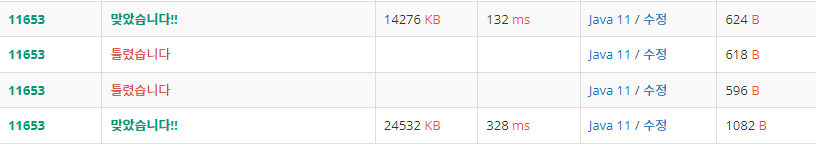

# [참고]

- [위] 현재 코드
- [아래] prime인지 판단하고 계산

****

# [접근 방법]
- ***어떤 N이 두 개 이상 곱셈(인수)으로 나타낼 수 있을 때 인수 중 한 개 이상은 반드시 √N보다 작거나 같다.***
- 반복문의 범위를 √N까지 반복하는 것
- 여기서는 소인수분해를 하는 것이므로 한번 소수로 나누고 남은 나머지를 또 나누기 때문에 나눈 것에서 위의 두 개를 반복하면 되는 것
- 그래서 남은 나머지를 √N 이렇게 제곱근의 범위만큼 반복하게 한다.
- *주의! 반복문을 돌고 나오면 나눈 나머지의 값이 출력이 되지 않으므로 반복문을 벗어나서 N값을 추가해줘야 한다.*
  - 이때, 반복문을 종료하고 나온 값은 N이 1이 아니라면 N은 소수이자 인수인 것이 분명하다.