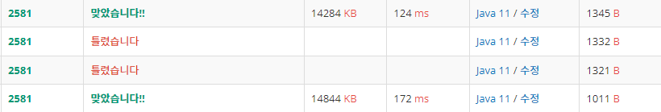

# [참고]
- OriginalMain : 알고리즘 없이 그냥 처음부터 소수 비교해서 품
- PrimeMain : 에라토스테네스의 체 알고리즘 사용

- [위] PrimeMain
- [아래] OriginalMain

****

# [문제 유형]
## 에라토스테네스의 체
- ***k=2 부터 √N 이하까지 반복하여 자연수들 중 k를 제외한 k의 배수들을 제외시킨다***
- k = 2 이면 2를 제외한 2의 배수를 모두 지워주고,
- k = 3 이면 3을 제외한 3의 배수를 모두 지워주고,
- ...
- 이렇게 해 k = √N 까지 반복하는 방법

### 알고리즘
```java
public static void makePrime(int N) {
		
    prime = new boolean[N + 1];	// 0 ~ N

    /**
    소수가 아닌 index = true
    소수인 index = false
    */
    
    // 2 미만의 N 을 입력받으면 소수는 판별할 필요 없으므로 바로 return
    if(N < 2) {
        return;
    }
    
    prime[0] = prime[1] = true;
    
    
    // 제곱근 함수 : Math.sqrt()
    for(int i = 2; i <= Math.sqrt(N); i++) {
    
        // 이미 체크된 배열이면 다음 반복문으로 skip
        if(prime[i] == true) {
            continue;
        }
    
        // i 의 배수들을 걸러주기 위한 반복문
        for(int j = i * i; j < prime.length; j = j+i) {
            prime[j] = true;
        }
    }
```
- 처음 for반복문을 N의 제곱근 만큼 도는 이유
  - i의 배수들을 걸러줄 때 i*i부터 시작하는데 그 이유는 이전 i-1까지 i보다 작은 수들은 이미 배수로 걸러줬기 때문에 자기랑 같은 값인 i부터 곱하면서 반복을 돈다.
  - 이후로 N의 제곱근 차례가 되면 √N*√N 형태가 되고, 그 다음부터 √N*(√N+1)은 N보다 큰 수 이므로 제곱근까지 반복문을 돌게 하는 것이다.